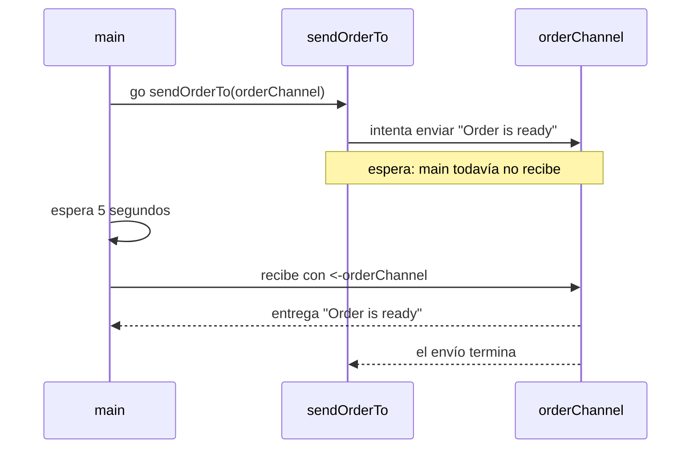

# Channels

Un **channel** es un camino por el que una goroutine le pasa un dato a otra.
Por ejemplo, el servicio de delivery puede avisarle a la pantalla que un pedido
está listo.

```go
orderChannel := make(chan string)
```

Esto crea un channel que transporta textos. Las flechas se leen así:

```go
orderChannel <- "Order is ready" // enviar hacia el channel
order := <-orderChannel           // recibir desde el channel
```

## Recorrido

- `main_1.go`: una goroutine envía un pedido y `main` lo recibe.
- `main_2.go`: `main` tarda cinco segundos en recibir. El envío queda detenido
  hasta que aparece alguien que escuche.
- `main_3.go`: es el mismo caso que el paso 2, pero solo cambia a
  `make(chan string, 2)`. Ahora el emisor puede continuar aunque `main` todavía
  no haya recibido el pedido.
- `main_4.go`: aplica la misma idea a dos pedidos, con funciones separadas para
  enviar y recibir.
- `main_5.go`: es igual al paso 4, pero el receptor tarda un segundo en procesar
  cada pedido. Como no hay buffer, el emisor debe esperar antes de continuar.
- `main_6.go`: es igual al paso 5; la única diferencia es el buffer para dos
  pedidos, que funciona como una pequeña fila.

Un channel sin buffer no guarda mensajes: quien envía espera a que alguien
reciba. El buffer sí es una fila con capacidad limitada.

Ejecutar: `go run main_1.go`.

## Flujo de `main_2.go`


